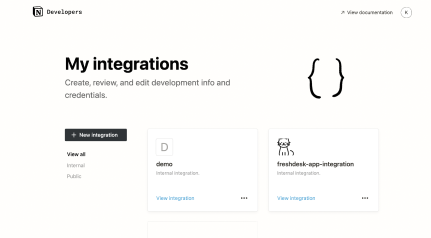
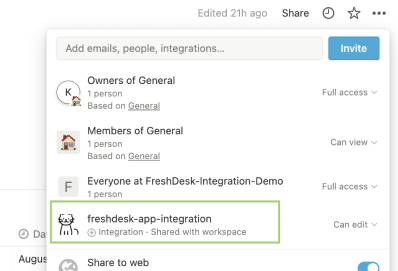
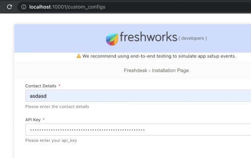

#  Freshdesk Notion App  

Notion App Integration for creating and sharing Notion pages as self help articles via Ticket Replies

##  Technologies Used
- [Freshdesk SDK](https://developers.freshdesk.com/v2/docs/quick-start/) 
	-  Data Methods
	-  Instance Methods
	-  Interface Methods
	-  Product Events
	-  Installation Parameters(iparams)
  

-  [Notion API](https://developers.notion.com/reference/intro)	
	- Working with Notion Databases, Pages, Properties
	- Pagination Using Cursor
	- Notion API Integration
	- Filtering ,Sorting  data from API

  

- [Crayons Library](https://crayons.freshworks.com/)
	 - Using Custom Styled Components
	 - Working with Custom Component Events 
	 - Using reusable classes like `fw-flex` for designing and layout

  

##  Steps to Setup your own Notion <-> Freshdesk App
1. Create a Notion Account 
2.  Duplicate this [template](https://enchanted-bougon-d59.notion.site/2718c9eddc784e719b19a65ac9ff0e1b?v=41c555d0de37479182eabb37f42cddd0) for database template  
3.  Create a new notion integration and copy the 50 character `api_key` from https://www.notion.so/my-integrations

4.  Share the database with the integration to access it using API. 

5. Clone the repo `git clone https://github.com/kunal-singhh/notion-freshdesk`
6. Type command `fdk run` to run your app
7. Open the url `http://localhost:10001/custom_configs` for setting up your `api_key` copied at point `3` and paste your api key with Name

8. Go to your freshdesk account ticket page and append it with `?dev=true` to test the application eg: `https://<YOUR_DOMAIN>.freshdesk.com/a/tickets/4?dev=true`
  

## Development Platform Use Cases in App
Feature | Purpose
App lifecycle methods |	app.initialized(), app.activated() 
Data methods  |	To get ticket details, user details
Interface methods |	To open/close modal, send/receive data across instances and create new ticket reply or append data to ticket reply
Request methods |	For api calls post, get etc
Instance methods | 	To get context inside modal - sharing data to-and-fro
Installation params |  custom installation page (iparams.json is used) to collect api keys and user details

##  Notes
-  We Can not invoke interface methods from modal hence pass them back to parent and then invoke interface methods
-  instance methods can be used to send data between different instances modal <-> app

