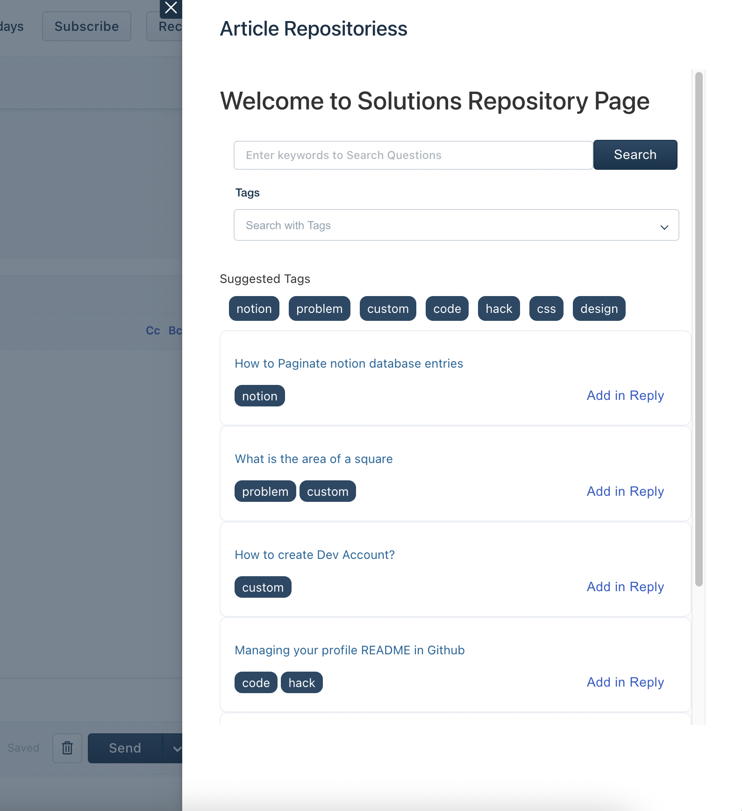

## Freshdesk Notion App

Notion App Integration for creating and sharing Notion pages as self help articles via Ticket Replies

## Future Scope
- Work on a Sync up tool which syncs notion pages with Solution Articles in Freshdesk

## Learnings 

- Freshdesk SDK (https://developers.freshdesk.com/v2/docs/quick-start/)
- Freshdesk API  (https://developers.freshdesk.com/api/)
- Notion API (https://developers.notion.com/reference/intro)
- Crayons Library (https://crayons.freshworks.com/)

# Notes 

- Can not invoke interface methods from modal hence pass them back to parent and then invoke interface methods 
- instance methods can be used to send data between different instances modal <-> app 