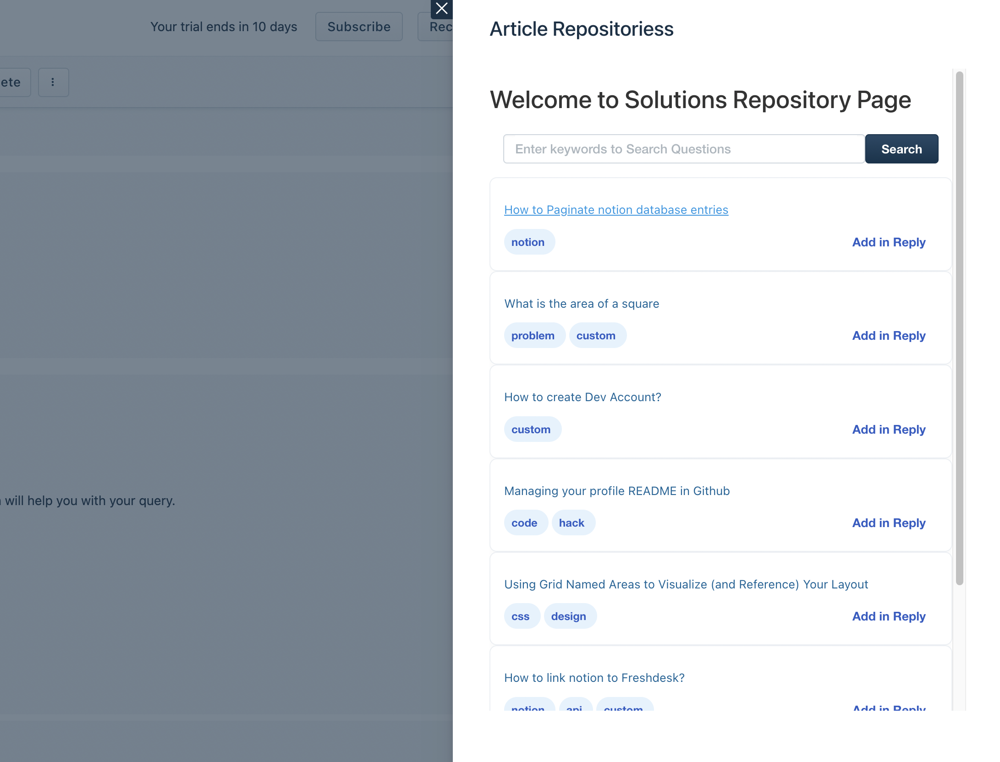
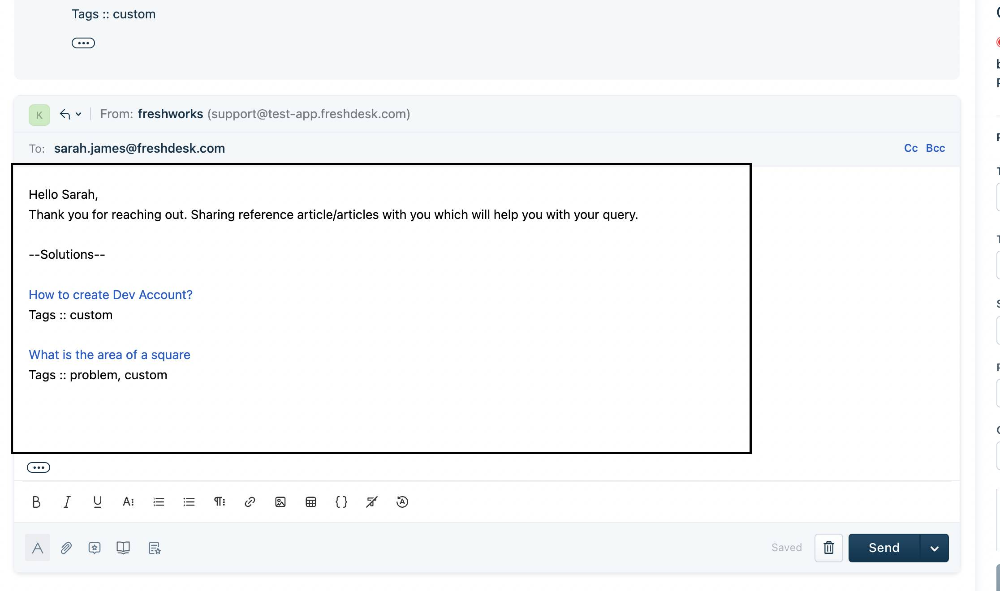
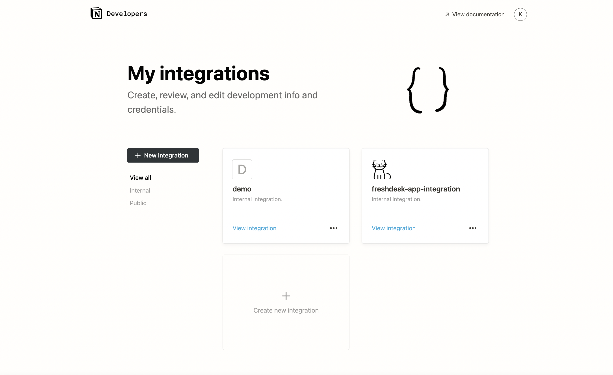

## Freshdesk Notion App

- Notion App Integration for creating and sharing Notion pages as self help articles via Ticket Replies

## Learnings 

### Freshdesk SDK (https://developers.freshdesk.com/v2/docs/quick-start/)

- Data Methods 
- Instance Methods 
- Interface Methods  
- Product Events 
- Installation Parameters 

### Freshdesk API  (https://developers.freshdesk.com/api/)
Initialially used API instead of SDK to update tickets hence explored the API for creating and fetching Tickets 

### Notion API (https://developers.notion.com/reference/intro)
Working with Notion Databases, Pages, Properties 

### - Crayons Library (https://crayons.freshworks.com/)
1. Custom Styled Components 

### Steps to Setup your own Notion Freshdesk App 

1. Duplicate the template for database template https://enchanted-bougon-d59.notion.site/2718c9eddc784e719b19a65ac9ff0e1b?v=41c555d0de37479182eabb37f42cddd0

2. Create a new notion integration and copy the 50 character `api_key`  from https://www.notion.so/my-integrations

3. Share the database with the integration

3. 

## Notes 

- Can not invoke interface methods from modal hence pass them back to parent and then invoke interface methods 
- instance methods can be used to send data between different instances modal <-> app 

## Future Scope
- Work on a Sync up tool which syncs notion pages with Solution Articles in Freshdesk

